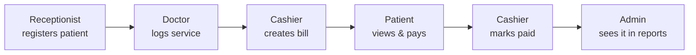

# ClearBill

A full-stack hospital billing management system — patients get registered, doctors log the services they receive, cashiers turn that into a bill and collect payment, and admins keep an eye on revenue across the whole operation.

## 📦 Tech Stack

- **Frontend:** React.js, React Router
- **Backend:** Node.js, Express, Sequelize
- **Auth:** JWT
- **Database:** MySQL, hosted on Aiven
- **Deployment:** Vercel

## 👥 Roles

| Role | What they do |
|---|---|
| **Admin** | Creates user accounts, pulls revenue reports |
| **Receptionist** | Registers new patients |
| **Doctor** | Enters the service a patient used, by service ID |
| **Cashier** | Takes the doctor's input, generates the bill, and updates payment status |
| **Patient** | Views their bills in detail, payment history, and profile |



## 🛠️ How It Was Built

The project started by splitting the code into `backend/` and `frontend/` folders, then working backend-first: models, controllers, and routes were planned out in Sequelize before any UI existed. Login/auth came next, wired up with JWT so every role could authenticate the same way, followed by each role's own features. The frontend talks to the API over plain `fetch` — the plan was to move to axios, but time didn't allow it. The database runs on Aiven (MySQL) with the frontend deployed on Vercel.

## 📚 What I Learned

During this project, I picked up a lot about structuring a multi-role, full-stack app end to end.

**🔐 JWT & Role-Based Access:**
- **Middleware Design**: Building `verifyAdmin`, `verifyDoctor`, `verifyCashier`, and the rest taught me how to layer middleware — each role check calls the base token verifier first, then adds its own rule on top.

**🔗 Sequelize Associations:**
- **Relational Thinking**: Mapping out `User` ↔ `Patient` (one-to-one), `Patient` ↔ `Bill` (one-to-many), and `Bill`/`Service` ↔ `BillDetail` (the join table between them) meant really understanding foreign keys and when to eager-load with `include`.

**🔄 Designing a Cross-Role Workflow:**
- **API Contracts**: A doctor's service entry has to end up in a cashier's bill, which has to show up correctly on a patient's dashboard. Getting that handoff right across separate endpoints took a lot of thinking about what each step actually needs to pass along.

**🧭 Role-Based Routing in React:**
- **React Router**: Structuring routes and layouts per role (`/admin/*`, `/doctor/*`, `/cashier/*`, etc.) helped me understand how to keep a single-page app organized as the number of user types grows.

**📊 Building a Revenue Report:**
- **Data Aggregation**: Using Sequelize's `Op.between` to pull payments in a date range, then grouping them by day for the admin's revenue chart, was my first real dive into aggregating data on the backend instead of just fetching and displaying it.

**🌐 Auth Flow with fetch:**
- **Reusable Patterns**: Writing an `authFetch` wrapper that automatically attaches the JWT from `localStorage` to every request saved me from repeating the same header on every single API call.

## 💭 How Can It Be Improved?

- Hash passwords with `bcryptjs` instead of storing and comparing them in plain text.
- Write real Sequelize migrations that match the actual schema (the current ones are unused scaffolding).
- Lock CORS down to the deployed frontend origin instead of allowing all origins.
- Add request validation (e.g. `express-validator` or `zod`) on the write endpoints.
- Swap `fetch` calls for axios across the frontend.
- Add automated tests for the auth and billing flows.

## 🚦 Running the Project

To run the project in your local environment, follow these steps:

1. Clone the repository to your local machine.
2. Set up a MySQL database using the schema in [`docs/REFERENCE.md`](docs/REFERENCE.md#database-setup).
3. In `backend/`, run `npm install`, add a `.env` file (see below), then run `node server.js`.
4. In `frontend/`, run `npm install`, add a `.env` file (see below), then run `npm run dev`.
5. Open `http://localhost:5173` (or the address shown in your console) to view the app.

**`backend/.env`:**
```env
DB_NAME=clearbill
DB_USER=root
DB_PASS=your_mysql_password
DB_HOST=127.0.0.1
DB_PORT=3306


**`frontend/.env`:**
```env
VITE_API_URL=http://localhost:5000
```

## 📄 Docs

- [Full API reference](docs/REFERENCE.md#api-reference) — every route, method, and required role
- [Data model / ER diagram](docs/REFERENCE.md#data-model)
- [Database setup SQL](docs/REFERENCE.md#database-setup)


## License

No license file is currently included. Add one (MIT is a common default) if you intend for others to reuse the code.
Mini Video of my project 
[New Tab - Brave 2026-07-18 20-33-00.zip](https://github.com/user-attachments/files/30151521/New.Tab.-.Brave.2026-07-18.20-33-00.zip)


